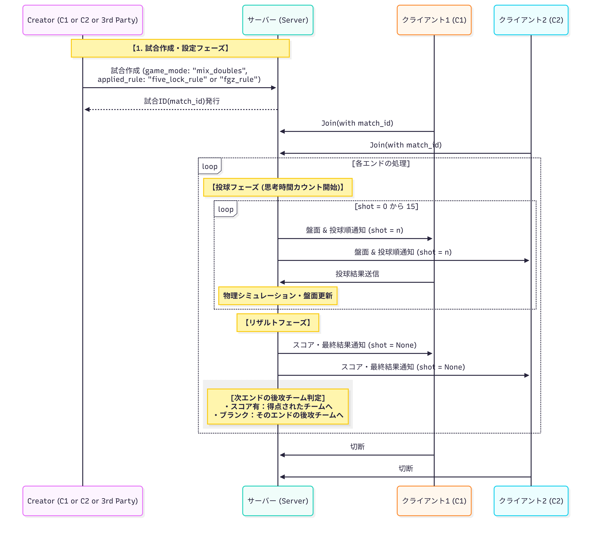

# New Client For Digital Curling

This is a new client for digital curling.

## Language
- [English(default)](https://github.com/kr-work/DC4-client-template/blob/main/README.md)
- [Japanese](https://github.com/kr-work/DC4-client-template/blob/main/README.ja.md)

## Install requirements.txt
```bash
pip install -r requirements.txt
```

We plan to release this repository on pypi eventually, but currently use
```bash
pip install .
```

## How to use
### Prepare user data
To play a match, each user must be registered on the server.
Example:

```
MATCH_USER_NAME="user"
PASS_WORD="password"
```
By default, a file named .env.sample is included. Rename it to .env and set your own username and password registered on the server in this file.

## Make Match

### Match Setting File
In the "src.setting.json" file, describe the information required for the match, such as standard_end_count, time_limits, the simulator to be used, and the applied_rule.

Please set game_mode to either **standard** or **mixed_doubles**.

- If standard is selected: 
A 4-player match will start. 
In this case, please select one of the following for applied_rule:
    - fgz_rule
    - no_tick_rule

- If mixed_doubles is selected: 
A match compatible with Mixed Doubles will start. In this case, please select following for applied_rule.
    - modified_fgz_rule
Please note that for mixed doubles, enter a number between 0 and 5 in the **positioned_stones_pattern** field. This determines the placement of the stones at each end.


(Currently, "fcv1" is the only simulator available, so matches cannot be played on other simulators.)

## Match Making
After completing the settings in setting.json, enter the following command.
```bash
cd src
python match_maker.py
```
The above command should be entered when you want to start a new match.

The match_id will now be stored in match_id.json.

### Connect client to server
I prepared folders named client0 and client1 so that we could actually play against each other.(When distributing, delete the client0 and client1 folders and refer to sample_client.py)

You can configure the players who will play in that match in “client0.team0_config.json” and “client1.team1_config.json”. In addition, when playing with the same settings as in the tournament, you can set
```md
"use_default_config": true
``` 
If you want to create a unique team,

```md
"use_default_config": false
``` 

After the above settings are in place, connect the client to the server by entering the following command

```bash
cd client0
python client.py
```

Then open another terminal,
```bash
cd client1
python client.py
```

I think you can check the connection with these command.

## Match flow
### Four-player curling
The protocol for four-player curling is .

1. Instantiate the client  
```Python
client = DCClient(match_id=match_id, username=username, password=password, match_team_name=MatchNameModel.team0)
```
match_id is received from the server when a match is created.
username and password are required to identify the client. In production each participant should set their own username and password. For now you can use the preconfigured values in the project [.env](./.env).

First, send your team information to the server. See [team_config.json](./team_config.json) for an example.

2. Set server host and port
Use the set_server_address function inside DCClient to set the server host and port:
```Python
client.set_server_address(host="localhost", port=5000)
```

3. Send team information
Send your team information to the server using the **send_team_info** function.
At this time, you will receive from the server which team plays first/second in the first end.
(First -> team0, Second -> team1)

4. Start the match
Receive state data from the server. If the next shot team matches your team name (team0 or team1), send a shot to the server using **send_shot_info**.

You can also send shot data in the same format as Digital Curling 3rd generation using **send_shot_info_dc3**.
Arguments:
- vx
- vy
- rotation ("cw" or "ccw")

5. End of the match
When **winner_team** in the state data becomes team0 or team1, the match is finished.

### Mixed Doubles
The protocol for miced doubles is as follows .

1. Instantiate the client
```Python
client = DCClient(match_id=match_id, username=username, password=password, match_team_name=MatchNameModel.team0)
```
match_id is received from the server when a match is created.
username and password are required to identify the client. In production each participant should set their own username and password. For now you can use the preconfigured values in the project [.env](./.env).

First, send your team information to the server.
See [md_team_config.json](./md_team_config.json) for an example. (Only the team data differs from four-player curling.)

2. Set server host and port (same as four-player curling)
Use the set_server_address function inside DCClient to set the server host and port:
```Python
client.set_server_address(host="localhost", port=5000)
```

3. Send team information (same as four-player curling)
Send your team information to the server using **send_team_info**.
At this time, you will receive from the server which team plays first/second in the first end.
(First -> team0, Second -> team1)

4. Start the match
At match start, the server sends a state where **next_shot_team** is None. At the beginning of each end, you must choose the positioned stones.

Use the following to choose the positioned stones pattern (and optional power play):
```Python
class PositionedStonesModel(str, enum.Enum):
    center_guard = "center_guard"
    center_house = "center_house"
    pp_left = "pp_left"
    pp_right = "pp_right"
```

Power play can be used only once per team per match. After the second attempt, **center_guard** is automatically selected.

- PositionedStonesModel.center_guard -> Positioned stones at guard, take first throw
- PositionedStonesModel.center_house -> Positioned stones in house, take second throw
- PositionedStonesModel.pp_left -> Power play: positioned stones on the left, take second throw
- PositionedStonesModel.pp_right -> Power play: positioned stones on the right, take second throw

After that, receive state data from the server. If the next shot team matches your team name (team0 or team1), send a shot to the server using **send_shot_info**.

You can also send shot data in the same format as Digital Curling 3rd generation using **send_shot_info_dc3**.

5. End of the match (same as four-player curling)
When **winner_team** in the state data becomes team0 or team1, the match is finished.
